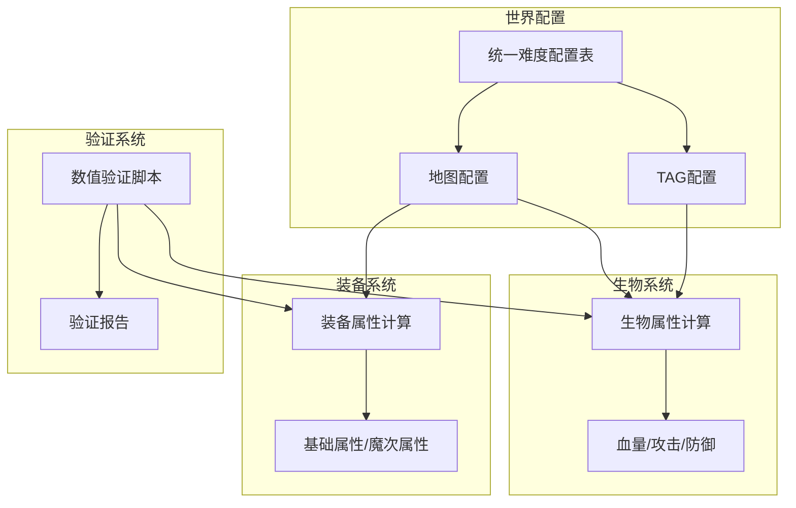
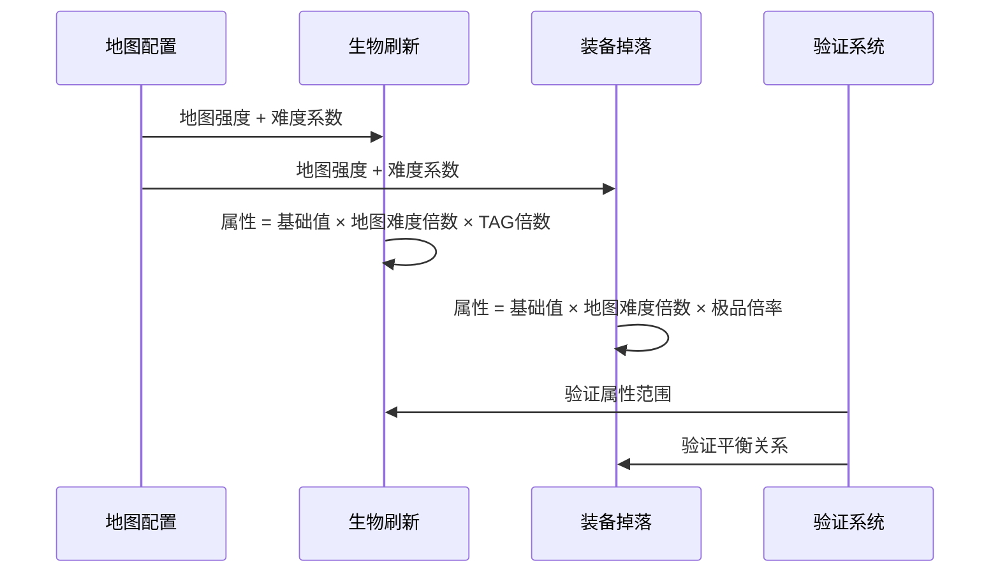

# Design Document: 数值平衡优化

## Overview

本设计文档描述了生物属性与装备数值平衡优化的技术方案。核心目标是：
1. 简化计算逻辑，降低CPU消耗
2. 统一数值配置，便于调整平衡
3. 建立清晰的数值关系，使游戏进度感更明确

## Architecture

### 系统架构图



### 数据流



## Components and Interfaces

### 1. 统一难度配置模块 (世界配置.ts)

```typescript
// 难度系数配置（核心配置，所有数值计算的基础）
export const 难度系数配置 = {
    简单: 1,      // 基准难度
    普通: 3,      // 3倍递增
    困难: 10,     // 约3倍递增
    精英: 30,     // 3倍递增
    炼狱: 100,    // 约3倍递增
    圣耀: 300,    // 3倍递增
} as const

// TAG倍数配置（统一管理怪物类型强度）
export const TAG倍数配置 = {
    1: 1,       // 基础小怪 - 基准
    2: 2,       // 挑战小怪 - 2倍
    3: 4,       // 稀有怪物 - 4倍
    4: 8,       // 精英怪物 - 8倍
    5: 16,      // 首领怪物 - 16倍
    6: 50,      // 大陆BOSS - 约3倍于首领
    7: 160,     // 特殊BOSS - 10倍于首领
} as const

// 生物基础值配置（简化为单一基础值）
export const 生物基础值配置 = {
    血量: 1000,
    攻击: 100,
    防御: 50,
} as const

// 装备基础值配置
export const 装备基础值配置 = {
    属性基础: 100,
    魔次基础: 10,
} as const
```

### 2. 生物属性计算模块 (生物属性.ts)

```typescript
interface 生物属性结果 {
    血量: string
    攻击: string
    防御: string
}

/**
 * 计算生物属性（简化版，仅3次乘法）
 * 公式: 属性 = 基础值 × 地图难度倍数 × TAG倍数
 */
export function 计算生物属性(
    地图强度: number,
    难度: string,
    TAG: number
): 生物属性结果 {
    // 获取配置
    const 难度系数 = 难度系数配置[难度] || 1
    const TAG系数 = TAG倍数配置[TAG] || 1
    
    // 计算地图难度倍数（第1次乘法）
    const 地图难度倍数 = String(地图强度 * 难度系数)
    
    // 计算各属性（第2-3次乘法）
    const 血量 = 智能计算(
        智能计算(String(生物基础值配置.血量), 地图难度倍数, 3),
        String(TAG系数), 3
    )
    const 攻击 = 智能计算(
        智能计算(String(生物基础值配置.攻击), 地图难度倍数, 3),
        String(TAG系数), 3
    )
    const 防御 = 智能计算(
        智能计算(String(生物基础值配置.防御), 地图难度倍数, 3),
        String(TAG系数), 3
    )
    
    return { 血量, 攻击, 防御 }
}
```

### 3. 装备属性计算模块 (装备掉落.ts)

```typescript
/**
 * 计算装备属性（简化版，仅4次乘法）
 * 公式: 属性 = 基础值 × 地图难度倍数 × 随机倍数 × 极品倍率
 */
export function 计算装备属性(
    地图强度: number,
    难度: string,
    极品倍率: number = 1
): string {
    // 获取配置
    const 难度系数 = 难度系数配置[难度] || 1
    
    // 计算地图难度倍数
    const 地图难度倍数 = String(地图强度 * 难度系数)
    
    // 随机倍数（0.8-1.2，小范围波动）
    const 随机倍数 = String(0.8 + Math.random() * 0.4)
    
    // 计算属性值
    let 属性值 = 智能计算(String(装备基础值配置.属性基础), 地图难度倍数, 3)
    属性值 = 智能计算(属性值, 随机倍数, 3)
    
    if (极品倍率 > 1) {
        属性值 = 智能计算(属性值, String(极品倍率), 3)
    }
    
    return 属性值
}
```

### 4. 数值验证模块 (数值验证.ts)

```typescript
interface 验证结果 {
    通过: boolean
    错误列表: string[]
    建议: string[]
}

/**
 * 验证数值配置的合理性
 */
export function 验证数值配置(): 验证结果 {
    const 错误列表: string[] = []
    const 建议: string[] = []
    
    // 验证难度递增比例（2-5倍）
    const 难度列表 = Object.entries(难度系数配置)
    for (let i = 1; i < 难度列表.length; i++) {
        const 上一难度 = 难度列表[i - 1][1]
        const 当前难度 = 难度列表[i][1]
        const 比例 = 当前难度 / 上一难度
        
        if (比例 < 2 || 比例 > 5) {
            错误列表.push(`难度递增比例异常: ${难度列表[i-1][0]}→${难度列表[i][0]} = ${比例.toFixed(2)}倍`)
        }
    }
    
    // 验证TAG倍数是否为整数
    for (const [tag, 倍数] of Object.entries(TAG倍数配置)) {
        if (!Number.isInteger(倍数)) {
            错误列表.push(`TAG${tag}倍数不是整数: ${倍数}`)
        }
    }
    
    // 验证装备能否应对同难度生物
    // 装备攻击应大于TAG1防御
    
    return {
        通过: 错误列表.length === 0,
        错误列表,
        建议
    }
}
```

## Data Models

### 地图配置数据模型

```typescript
interface 地图配置 {
    地图名: string
    地图强度: number      // 基础强度值（1-1000）
    默认难度: string      // 默认难度等级
    需求等级: number      // 进入等级要求
}
```

### 生物配置数据模型

```typescript
interface 生物配置 {
    TAG: number           // 怪物类型（1-7）
    名称: string          // 怪物名称
    // 属性由计算函数动态生成，不再存储固定值
}
```

### 装备配置数据模型

```typescript
interface 装备配置 {
    基础词条数: { min: number, max: number }
    魔次词条数: { min: number, max: number }
    魔次几率: number      // 获得魔次词条的几率
}
```

## Correctness Properties

*A property is a characteristic or behavior that should hold true across all valid executions of a system-essentially, a formal statement about what the system should do. Properties serve as the bridge between human-readable specifications and machine-verifiable correctness guarantees.*

### Property 1: 生物属性计算乘法次数限制

*For any* 地图强度、难度和TAG组合，生物属性计算过程中的大数值乘法次数不超过3次。

**Validates: Requirements 1.1, 1.2, 1.3**

### Property 2: 难度递增比例约束

*For any* 相邻的两个难度等级，后一难度的系数与前一难度的系数之比应在2-5倍范围内。

**Validates: Requirements 3.3, 7.4**

### Property 3: TAG倍数整数约束

*For any* TAG值（1-7），其对应的倍数配置必须是正整数。

**Validates: Requirements 4.4**

### Property 4: 装备与生物平衡关系

*For any* 地图强度和难度组合，当前难度的装备攻击值应大于同难度TAG1生物的防御值。

**Validates: Requirements 3.1, 7.3**

### Property 5: 生物属性范围验证

*For any* 地图强度（1-1000）、难度（6种）和TAG（1-7）的组合，计算出的生物属性应在合理范围内（血量>0，攻击>0，防御>=0）。

**Validates: Requirements 7.2**

### Property 6: 装备属性与地图难度正比关系

*For any* 两个不同的地图难度倍数，装备属性值应与地图难度倍数成正比（误差不超过20%）。

**Validates: Requirements 5.4**

## Error Handling

### 配置错误处理

1. **难度配置缺失**: 使用默认值1
2. **TAG配置缺失**: 使用默认值1
3. **地图强度为0或负数**: 使用最小值1
4. **计算结果为NaN或Infinity**: 返回默认最小值

### 验证失败处理

1. 输出详细错误信息到控制台
2. 记录到日志文件
3. 提供建议的修正值

## Testing Strategy

### 单元测试

1. 测试各配置值的边界情况
2. 测试计算函数的正确性
3. 测试错误处理逻辑

### 属性测试

使用属性测试框架验证上述6个正确性属性，每个属性运行至少100次随机测试。

### 集成测试

1. 测试生物刷新流程
2. 测试装备掉落流程
3. 测试数值验证流程

### 测试配置

```typescript
// 使用 fast-check 进行属性测试
import * as fc from 'fast-check'

// 地图强度生成器
const 地图强度生成器 = fc.integer({ min: 1, max: 1000 })

// 难度生成器
const 难度生成器 = fc.constantFrom('简单', '普通', '困难', '精英', '炼狱', '圣耀')

// TAG生成器
const TAG生成器 = fc.integer({ min: 1, max: 7 })
```
