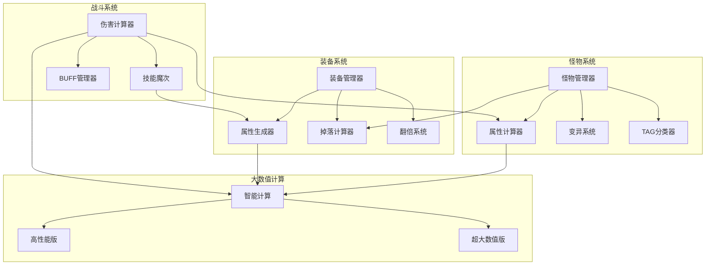

# 设计文档

## 概述

本设计文档描述了怪物属性与装备属性系统的技术架构和实现方案。系统核心目标是建立怪物属性与装备掉落之间的关联机制，通过属性翻倍、变异系统和技能魔次等元素，为玩家提供惊喜感和挑战性的游戏体验。

### 设计目标

1. **属性关联**: 怪物属性决定装备掉落属性
2. **惊喜机制**: 通过变异和翻倍系统提供随机惊喜
3. **平衡性**: 伤害计算公式确保战斗平衡
4. **可扩展性**: 支持新增怪物类型和装备属性
5. **大数值支持**: 所有数值计算使用大数值计算方法（参考 `大数值/核心计算方法.ts`）

## 架构设计



## 组件与接口

### 1. 怪物管理器 (MonsterManager)

负责怪物的创建、属性分配和变异处理。

```typescript
interface 怪物属性 {
    生命值: string;      // 大数值字符串
    防御力: string;      // 大数值字符串
    攻击力: string;      // 大数值字符串
    魔次抵抗: string;    // 大数值字符串
}

interface 怪物实例 {
    TAG: string;         // 怪物标识，后缀1-5
    类型: 怪物类型;      // 小怪/精英/BOSS/特殊
    属性: 怪物属性;
    是否变异: boolean;
    变异类型?: 变异类型;
    是否磨怪: boolean;
}

enum 怪物类型 {
    小怪 = 1,           // TAG后缀1-2
    精英 = 2,           // TAG后缀3-4
    BOSS = 3,           // TAG后缀5
    特殊怪物 = 4,       // 特殊类型
    特殊BOSS = 5        // 特殊BOSS
}
```

### 2. 变异系统 (MutationSystem)

处理怪物变异逻辑和属性加成。

```typescript
enum 变异类型 {
    普通变异 = 1,       // 属性+50%
    稀有变异 = 2,       // 属性+100%
    传说变异 = 3,       // 属性+200%
    磨怪变异 = 4        // 生命值+500%，攻击+50%
}

interface 变异配置 {
    类型: 变异类型;
    生命倍率: string;   // 大数值字符串，如 "150" 表示150%
    攻击倍率: string;   // 大数值字符串
    掉落加成: number;   // 稀有装备掉落率加成百分比
    外观后缀: string;   // 名称后缀，如"[变异]"
    颜色代码: number;   // 怪物颜色
}

// 变异属性计算示例（使用大数值计算）
import { 智能计算 } from "../大数值/核心计算方法";

function 应用变异(基础生命: string, 倍率: string): string {
    // 使用智能计算进行乘法运算 (mode=3)
    return 智能计算(基础生命, 倍率, 3);
}
```

### 3. 装备管理器 (EquipmentManager)

管理装备生成和属性分配。装备属性通过 `OutWay1/OutWay2/OutWay3` 三层结构存储：
- **OutWay1**: 属性ID（标识属性类型）
- **OutWay2**: 前端数字值（显示用的数值）
- **OutWay3**: 后端单位值（大数值的单位部分）

```typescript
// 装备属性ID定义（OutWay1的值）
enum 装备属性ID {
    // 基础属性
    血量 = 167,
    防御 = 168,
    攻击 = 161,
    魔法 = 162,
    道士 = 163,
    刺术 = 164,
    箭术 = 165,
    武术 = 166,
    
    // 特殊属性
    吸血比例 = 302,
    攻速魔速 = 310,
    
    // 天赋属性 (620-628)
    体质强化 = 620,
    // ... 其他天赋
}

interface 装备属性 {
    血量: string;       // 大数值字符串
    防御: string;       // 大数值字符串
    攻击: string;       // 大数值字符串
    魔法: string;       // 大数值字符串
    道士: string;       // 大数值字符串
    刺术: string;       // 大数值字符串
    箭术: string;       // 大数值字符串
    武术: string;       // 大数值字符串
    技能魔次: Map<number, string>;  // 技能ID -> 魔次值（大数值字符串）
}

interface 装备实例 {
    槽位: number;       // 1-18
    基础属性: 装备属性;
    翻倍信息: 翻倍结果;
    最终属性: 装备属性;
    品质: 装备品质;
}

enum 装备品质 {
    普通 = 1,
    优秀 = 2,
    精良 = 3,
    极品 = 4,
    神品 = 5
}

// 设置装备属性示例
function 设置装备属性(物品: UserItem, 索引: number, 属性ID: number, 前端数字值: number, 后端单位值: number): void {
    物品.SetOutWay1(索引, 属性ID);
    物品.SetOutWay2(索引, 前端数字值);
    物品.SetOutWay3(索引, 后端单位值);
}
```

### 4. 技能魔次系统 (SkillMagicLevel)

技能魔次的存储结构（与其他装备属性相同）：
- **OutWay1(索引)**: 存储属性ID（技能魔次枚举值，如10001表示攻杀剑术魔次）
- **OutWay2(索引)**: 存储前端数字值（魔次数值的显示部分）
- **OutWay3(索引)**: 存储后端单位值（大数值的单位部分）

```typescript
// 设置装备属性的统一函数
function 设置装备属性(物品: UserItem, 索引: number, 属性ID: number, 前端数字值: number, 后端单位值: number): void {
    物品.SetOutWay1(索引, 属性ID);   // 属性ID（技能魔次枚举值）
    物品.SetOutWay2(索引, 前端数字值); // 前端显示数值
    物品.SetOutWay3(索引, 后端单位值); // 后端单位（大数值）
}

// 技能魔次枚举 - 这些值作为属性ID存储在OutWay1中
// 来自 _P_Base.ts
export enum 技能魔次 {
    // 基础技能魔次 (10001-10013)
    攻杀剑术 = 10001, 刺杀剑术 = 10002, 半月弯刀 = 10003, 
    雷电术 = 10004, 暴风雪 = 10005, 灵魂火符 = 10006,
    飓风破 = 10007, 暴击术 = 10008, 霜月 = 10009, 
    精准剑术 = 10010, 万箭齐发 = 10011, 罗汉棍法 = 10012, 天雷阵 = 10013,
    
    // 职业技能魔次 (10014-10019)
    天枢 = 10014, 血神 = 10015, 暗影 = 10016, 
    烈焰 = 10017, 正义 = 10018, 不动 = 10019,
    
    // 全体技能魔次 (10020)
    全体 = 10020,
    
    // 新技能魔次 (10021-10050)
    怒斩 = 10021, 人之怒 = 10022, 地之怒 = 10023, 天之怒 = 10024, 神之怒 = 10025,
    血气献祭 = 10026, 血气燃烧 = 10027, 血气吸纳 = 10028, 血气迸发 = 10029, 血魔临身 = 10030,
    暗影猎取 = 10031, 暗影袭杀 = 10032, 暗影剔骨 = 10033, 暗影风暴 = 10034, 暗影附体 = 10035,
    火焰追踪 = 10036, 火镰狂舞 = 10037, 烈焰护甲 = 10038, 爆裂火冢 = 10039, 烈焰突袭 = 10040,
    圣光 = 10040, 行刑 = 10041, 洗礼 = 10042, 审判 = 10043, 神罚 = 10044,
    如山 = 10046, 泰山 = 10047, 人王盾 = 10048, 铁布衫 = 10049, 金刚掌 = 10050,
}

// 使用示例：设置装备的攻杀剑术魔次属性
// 设置装备属性(装备, 职业第一条, 技能魔次.攻杀剑术, 100, 0);
// 结果：
//   OutWay1(职业第一条) = 10001  (攻杀剑术的属性ID)
//   OutWay2(职业第一条) = 100    (魔次数值)
//   OutWay3(职业第一条) = 0      (单位)

// 读取示例：
// const 属性ID = 装备.GetOutWay1(索引);    // 获取属性ID，如10001
// const 魔次值 = 装备.GetOutWay2(索引);    // 获取魔次数值
// if (属性ID === 技能魔次.攻杀剑术) { ... } // 判断是否为攻杀剑术魔次
```

### 5. 属性翻倍系统 (AttributeMultiplier)

处理装备属性的翻倍计算，所有计算使用大数值方法。

```typescript
import { 智能计算, js_范围随机 } from "../大数值/核心计算方法";

enum 翻倍类型 {
    基础翻倍 = 1,       // 100%触发，倍率1-100
    极品翻倍 = 2,       // 根据极品率触发
    神品翻倍 = 3        // 1/2000触发，倍率1-20
}

interface 翻倍结果 {
    基础倍率: string;   // 大数值字符串，1-100
    极品倍率?: string;  // 大数值字符串，10 + 极品率/100
    神品倍率?: string;  // 大数值字符串，1-20
    最终倍率: string;   // 大数值字符串，所有倍率相乘
}

function 计算翻倍(玩家极品率: number): 翻倍结果 {
    // 基础翻倍：1-100随机
    const 基础 = js_范围随机('1', '100');
    
    let 极品: string | undefined;
    let 神品: string | undefined;
    
    // 极品翻倍判定
    if (random(100) < 玩家极品率) {
        // 极品倍率 = 10 + 极品率/100
        极品 = 智能计算('10', String(玩家极品率 / 100), 1);
    }
    
    // 神品翻倍判定 (1/2000)
    if (random(2000) < 1) {
        神品 = js_范围随机('1', '20');
    }
    
    // 计算最终倍率（所有倍率相乘）
    let 最终 = 基础;
    if (极品) {
        最终 = 智能计算(最终, 极品, 3);  // 乘法
    }
    if (神品) {
        最终 = 智能计算(最终, 神品, 3);  // 乘法
    }
    
    return {
        基础倍率: 基础,
        极品倍率: 极品,
        神品倍率: 神品,
        最终倍率: 最终
    };
}
```

### 6. 伤害计算器 (DamageCalculator)

实现伤害计算公式，使用大数值计算。

```typescript
import { 智能计算, 大于等于 } from "../大数值/核心计算方法";

interface 伤害计算参数 {
    玩家主属性: string;      // 大数值字符串
    怪物防御: string;        // 大数值字符串
    技能魔次: string;        // 大数值字符串
    怪物魔次抵抗: string;    // 大数值字符串
    BUFF加成: string;        // 大数值字符串，如 "150" 表示150%
}

function 计算伤害(参数: 伤害计算参数): string {
    const { 玩家主属性, 怪物防御, 技能魔次, 怪物魔次抵抗, BUFF加成 } = 参数;
    
    // 公式: (主属性 - 怪物防御) * (技能魔次 - 怪物魔次抵抗) * BUFF加成 / 100
    
    // 步骤1: 主属性 - 怪物防御
    const 基础伤害 = 智能计算(玩家主属性, 怪物防御, 2);  // 减法
    
    // 步骤2: 技能魔次 - 怪物魔次抵抗
    const 魔次系数 = 智能计算(技能魔次, 怪物魔次抵抗, 2);  // 减法
    
    // 步骤3: 基础伤害 * 魔次系数
    const 中间结果 = 智能计算(基础伤害, 魔次系数, 3);  // 乘法
    
    // 步骤4: 中间结果 * BUFF加成 / 100
    const 带BUFF = 智能计算(中间结果, BUFF加成, 3);  // 乘法
    const 最终伤害 = 智能计算(带BUFF, '100', 4);  // 除法取整
    
    // 最小伤害为1
    if (大于等于('1', 最终伤害)) {
        return '1';
    }
    
    return 最终伤害;
}
```

## 数据模型

### 怪物-装备属性映射表

```typescript
const 属性映射表: Map<string, number> = new Map([
    ['物理攻击', 装备属性ID.攻击],
    ['魔法攻击', 装备属性ID.魔法],
    ['道术攻击', 装备属性ID.道士],
    ['刺术攻击', 装备属性ID.刺术],
    ['箭术攻击', 装备属性ID.箭术],
    ['武术攻击', 装备属性ID.武术]
]);

const 防御映射表: Map<string, number> = new Map([
    ['物理防御', 装备属性ID.防御],
    ['综合防御', 装备属性ID.血量]
]);
```

### 掉落概率配置

```typescript
interface 掉落配置 {
    基础掉落率: number;
    BOSS加成: number;           // BOSS额外掉落率百分比
    变异加成: number;           // 变异怪物额外掉落率百分比
    磨怪加成: number;           // 磨怪额外掉落率百分比
    技能魔次装备概率: {
        小怪: number;           // 1%
        精英: number;           // 5%
        BOSS: number;           // 20%
        变异BOSS: number;       // 40%
    };
}
```

### 装备槽位定义

```typescript
// 装备槽位索引常量（来自 _ITEM_Base.ts）
const 装备需求 = 0;           // 装备等级需求
const 基础属性分割 = 1;       // 基础属性分隔符
const 基础属性第一条 = 2;
const 基础属性第十条 = 11;
const 职业分割 = 12;          // 职业属性分隔符
const 职业第一条 = 13;
const 天赋五 = 22;
```

## 正确性属性

*正确性属性是指在系统所有有效执行中都应该保持为真的特性或行为。属性作为人类可读规范和机器可验证正确性保证之间的桥梁。*

### 属性1: TAG分类正确性

*对于任意* 怪物实例，其TAG后缀应当正确映射到对应的怪物类型：
- TAG后缀1-2 → 小怪
- TAG后缀3-4 → 精英
- TAG后缀5 → BOSS

**验证需求: 1.2, 1.3, 1.4, 1.5**

### 属性2: 变异属性增强

*对于任意* 变异怪物，其生命值和攻击力应当大于同类型非变异怪物的基础值（使用大数值比较）

**验证需求: 2.3**

### 属性3: 装备属性映射一致性

*对于任意* 怪物掉落的装备，其主要属性类型（OutWay1）应当与怪物的攻击类型存在映射关系

**验证需求: 4.1, 4.2, 4.3**

### 属性4: 翻倍系统范围约束

*对于任意* 生成的装备：
- 基础翻倍倍率在1-100范围内
- 极品翻倍倍率 = 10 + 极品率/100
- 神品翻倍倍率在1-20范围内

**验证需求: 5.2, 5.3, 5.4**

### 属性5: 伤害计算最小值保证

*对于任意* 伤害计算结果，最终伤害值应当大于等于1（使用大数值比较 `大于等于('1', 结果)`）

**验证需求: 6.5**

### 属性6: 伤害公式正确性

*对于任意* 有效的伤害计算参数，计算结果应当等于:
`max(1, (主属性 - 怪物防御) * (技能魔次 - 怪物魔次抵抗) * BUFF加成 / 100)`
所有计算使用大数值方法

**验证需求: 6.1**

### 属性7: 磨怪生命值显著增加

*对于任意* 磨怪，其生命值应当显著高于同类型普通怪物（至少5倍，使用大数值乘法验证）

**验证需求: 2.6, 8.1**

### 属性8: 翻倍叠加正确性

*对于任意* 同时触发多种翻倍的装备，最终倍率应当等于所有触发倍率的乘积（使用大数值乘法）

**验证需求: 5.5**

## 错误处理

### 异常情况处理

```typescript
import { 智能计算, 大于等于 } from "../大数值/核心计算方法";

// 1. 无效TAG处理
function 解析TAG(tag: string): 怪物类型 {
    const 后缀 = parseInt(tag.slice(-1));
    if (isNaN(后缀) || 后缀 < 1 || 后缀 > 5) {
        // 默认返回小怪类型
        return 怪物类型.小怪;
    }
    // 正常分类逻辑
    if (后缀 <= 2) return 怪物类型.小怪;
    if (后缀 <= 4) return 怪物类型.精英;
    return 怪物类型.BOSS;
}

// 2. 负数伤害处理（使用大数值比较）
function 安全计算伤害(参数: 伤害计算参数): string {
    const 计算结果 = 计算伤害(参数);
    // 使用大数值比较确保最小伤害为1
    if (大于等于('1', 计算结果)) {
        return '1';
    }
    return 计算结果;
}

// 3. 翻倍溢出处理
function 应用翻倍(基础值: string, 倍率: string): string {
    const 结果 = 智能计算(基础值, 倍率, 3);  // 乘法
    // 大数值计算自动处理溢出
    return 结果;
}

// 4. 概率边界处理
function 随机概率(概率: number): boolean {
    const 有效概率 = Math.max(0, Math.min(100, 概率));
    return random(100) < 有效概率;
}
```

### 日志记录

```typescript
// 关键操作日志
function 记录装备生成(装备: 装备实例, 来源怪物: 怪物实例): void {
    console.log(`[装备生成] 槽位:${装备.槽位} 品质:${装备.品质} 来源:${来源怪物.TAG}`);
    if (装备.翻倍信息.神品倍率) {
        console.log(`[神品触发] 倍率:${装备.翻倍信息.神品倍率}`);
    }
}
```

## 测试策略

### 单元测试

单元测试用于验证具体示例和边界情况：

1. **TAG分类测试**: 验证各TAG后缀的分类正确性
2. **伤害计算边界测试**: 验证负数伤害、零伤害等边界情况（使用大数值）
3. **翻倍范围测试**: 验证各翻倍类型的范围约束
4. **属性映射测试**: 验证怪物-装备属性映射的正确性
5. **OutWay存储测试**: 验证OutWay1/OutWay2/OutWay3的正确读写

### 属性测试

属性测试用于验证跨所有输入的通用属性：

1. **TAG分类属性**: 随机生成TAG，验证分类一致性
2. **伤害最小值属性**: 随机生成参数，验证伤害≥1（大数值比较）
3. **翻倍范围属性**: 随机生成翻倍，验证范围约束
4. **变异增强属性**: 随机生成变异怪物，验证属性增强（大数值比较）
5. **大数值计算一致性**: 验证智能计算在不同数值范围的正确性

### 测试配置

- 属性测试最少运行100次迭代
- 每个属性测试需标注对应的设计文档属性编号
- 标注格式: **功能: monster-equipment-system, 属性 N: {属性描述}**
- 大数值测试需覆盖：小数值（<9e15）、大数值（>9e15）两种路径
