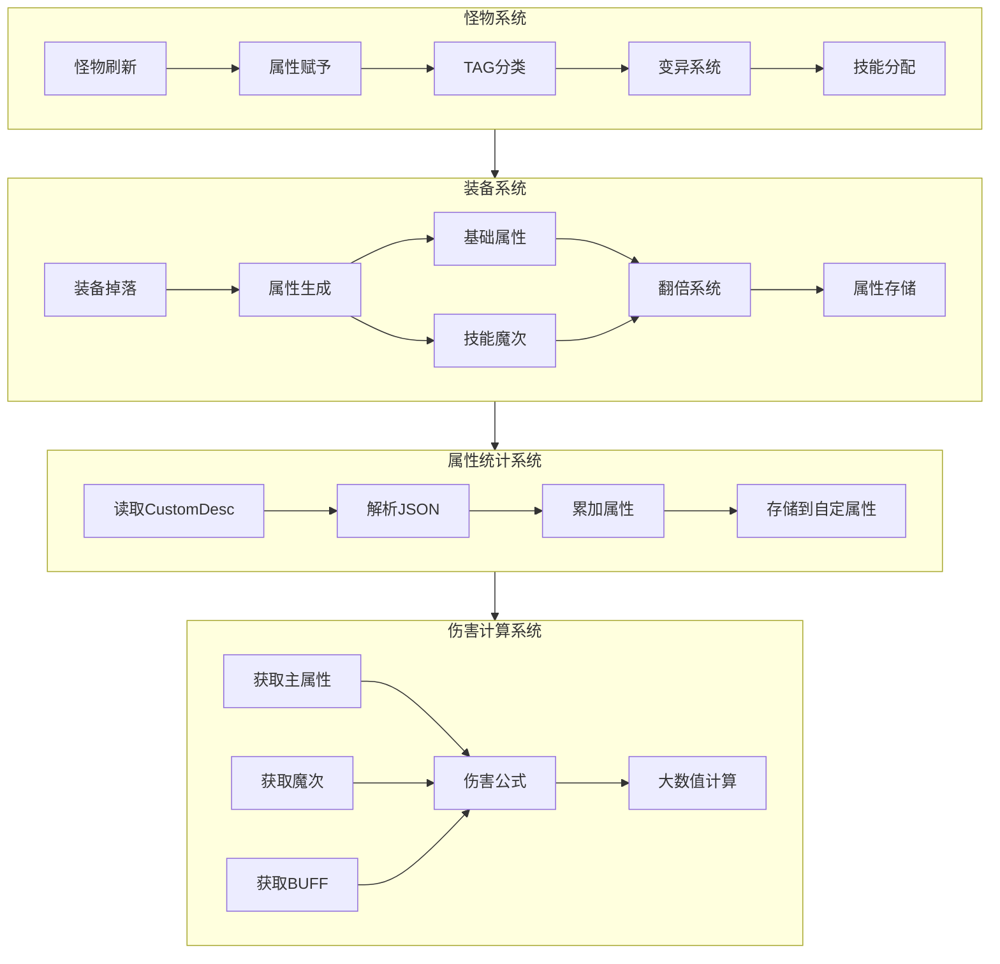

# Design Document: 怪物属性与装备属性系统

## Overview

本设计文档描述了无限恐怖项目中怪物属性与装备属性系统的完整架构。系统涵盖怪物生成、属性赋予、装备掉落、属性统计和伤害计算的完整流程。

系统基于现有的code项目架构模式，使用TypeScript实现，集成大数值计算引擎（核心计算方法.ts），支持999京范围内的数值计算。

## Architecture



## Components and Interfaces

### 1. Monster_System (怪物系统)

```typescript
// 文件: 功能脚本组/[怪物]/_M_Attribute.ts

/**
 * 怪物TAG类型枚举
 */
export enum MonsterTAG {
    小怪 = 1,      // TAG尾数1
    普通 = 2,      // TAG尾数2
    精英 = 3,      // TAG尾数3
    BOSS = 4,      // TAG尾数4
    特殊怪物 = 5,  // TAG尾数5
    特殊BOSS = 6   // TAG尾数6
}

/**
 * 怪物属性倍率配置
 */
export const MonsterMultiplier: Record<MonsterTAG, {min: number, max: number}> = {
    [MonsterTAG.小怪]: { min: 1, max: 5 },
    [MonsterTAG.普通]: { min: 5, max: 10 },
    [MonsterTAG.精英]: { min: 10, max: 30 },
    [MonsterTAG.BOSS]: { min: 30, max: 50 },
    [MonsterTAG.特殊怪物]: { min: 50, max: 200 },
    [MonsterTAG.特殊BOSS]: { min: 100, max: 500 }
}

/**
 * 怪物SVar索引常量
 */
export const MonsterSVar = {
    当前血量: 91,
    最大血量: 92,
    攻击: 93,
    基础防御: 94,
    魔次抵抗:95    
}

/**
 * 变异类型枚举
 */
export enum MutationType {
    属性强化 = 1,
    技能强化 = 2,
    特殊效果 = 3
}

/**
 * 怪物属性接口
 */
interface IMonsterAttribute {
    赋予属性(monster: TActor, tag: number, baseHP: string, baseDC: string, baseAC: string): void;
    判定变异(monster: TActor, mutationRate: number): boolean;
    应用变异(monster: TActor, mutationTypes: MutationType[]): void;
    分配技能(monster: TActor, skillCount: number): void;
}
```

### 2. Equipment_System (装备系统)

```typescript
// 文件: 功能脚本组/[装备]/_ITEM_Attribute.ts

/**
 * 基础属性ID映射
 */
export const BaseAttributeID = {
    血量: 31,    // 自定属性[167]
    防御: 32,    // 自定属性[168]
    攻击: 33,    // 自定属性[161]
    魔法: 34,    // 自定属性[162]
    道士: 35,    // 自定属性[163]
    箭术: 36,    // 自定属性[165]
    刺术: 37,    // 自定属性[164]
    武术: 38     // 自定属性[166]
}

/**
 * 技能魔次ID范围
 * 分组规则：
 * - 基础技能(10001-10013): 独立一组，统一提升基础技能伤害
 * - 职业技能(10014-10019) + 全体技能(10020): 合并为一组
 * - 新技能(10021-10050): 每隔5个为一组，即10021/10026/10031/10036/10041/10046各为一组起始
 */
export const SkillMagicLevel = {
    基础技能: { start: 10001, end: 10013 },           // 第1组
    职业技能: { start: 10014, end: 10019 },           // 第2组（与全体技能合并）
    全体技能: 10020,                                   // 第2组（与职业技能合并）
    新技能: { start: 10021, end: 10050, groupSize: 5 } // 第3-8组，每5个一组
}

/**
 * 新技能分组配置
 * 每组包含5个技能ID，共6组
 */
export const NewSkillGroups = [
    { groupId: 1, start: 10021, end: 10025 },  // 新技能组1
    { groupId: 2, start: 10026, end: 10030 },  // 新技能组2
    { groupId: 3, start: 10031, end: 10035 },  // 新技能组3
    { groupId: 4, start: 10036, end: 10040 },  // 新技能组4
    { groupId: 5, start: 10041, end: 10045 },  // 新技能组5
    { groupId: 6, start: 10046, end: 10050 }   // 新技能组6
]

/**
 * 获取技能魔次所属分组
 * @param skillId 技能魔次ID
 * @returns 分组信息 { groupType: string, groupId: number }
 */
function getSkillMagicGroup(skillId: number): { groupType: string, groupId: number } {
    // 基础技能组
    if (skillId >= 10001 && skillId <= 10013) {
        return { groupType: '基础技能', groupId: 1 };
    }
    // 职业技能 + 全体技能组
    if (skillId >= 10014 && skillId <= 10020) {
        return { groupType: '职业全体技能', groupId: 2 };
    }
    // 新技能组（每5个一组）
    if (skillId >= 10021 && skillId <= 10050) {
        const groupId = Math.floor((skillId - 10021) / 5) + 1;
        return { groupType: '新技能', groupId: groupId };
    }
    return { groupType: '未知', groupId: 0 };
}

/**
 * 装备属性存储结构
 * 注意：所有数值使用字符串存储，支持大数值运算
 */
interface IEquipmentAttribute {
    职业属性_职业数组: number[];   // 属性ID列表
    职业属性_属性数组: string[];   // 属性值列表（字符串格式，支持大数值）
}

/**
 * 装备属性生成器接口
 * 所有数值运算使用字符串/大数值，避免精度丢失
 */
interface IEquipmentGenerator {
    生成基础属性(monsterDC: string, count: number): {id: number, value: string}[];
    生成技能魔次(monsterLevel: number): {id: number, value: string, groupType: string, groupId: number}[];
    计算翻倍(baseValue: string, playerRate: number): string;
    序列化属性(attributes: IEquipmentAttribute): string;
    反序列化属性(json: string): IEquipmentAttribute;
    
    /**
     * 根据技能魔次分组生成属性
     * @param groupType 分组类型：'基础技能' | '职业全体技能' | '新技能'
     * @param groupId 分组ID（新技能为1-6）
     * @param value 魔次数值（字符串格式）
     */
    生成分组魔次(groupType: string, groupId: number, value: string): {id: number, value: string}[];
}
```

### 3. Attribute_Calculator (属性统计器)

```typescript
// 文件: 功能脚本组/[玩家]/_P_AttributeCalc.ts

/**
 * 自定属性索引映射
 */
export const CustomAttributeIndex: Record<number, number> = {
    31: 167,  // 血量
    32: 168,  // 防御
    33: 161,  // 攻击
    34: 162,  // 魔法
    35: 163,  // 道士
    36: 165,  // 箭术
    37: 164,  // 刺术
    38: 166   // 武术
}

/**
 * 属性统计器接口
 */
interface IAttributeCalculator {
    读取装备属性(player: TPlayObject): IEquipmentAttribute[];
    累加属性(attributes: IEquipmentAttribute[]): Map<number, string>;
    存储到自定属性(player: TPlayObject, totals: Map<number, string>): void;
    重新计算(player: TPlayObject): void;
}
```

### 4. Damage_Calculator (伤害计算器)

```typescript
// 文件: 功能脚本组/[玩家]/_P_DamageCalc.ts

/**
 * 伤害计算公式
 * 最终伤害 = (主属性 - 怪物防御) * (技能魔次 - 怪物魔次抵抗) * BUFF加成
 */
interface IDamageCalculator {
    计算伤害(
        主属性: string,
        怪物防御: string,
        技能魔次: number,
        怪物魔次抵抗: number,
        BUFF加成: number
    ): string;
}

/**
 * 伤害计算常量
 */
export const DamageConstants = {
    最小伤害: '1',
    最小魔次系数: 0.1,
    快速路径阈值: 9e15  // 9千万亿
}
```

## Data Models

### 怪物数据模型

```typescript
interface MonsterData {
    handle: number;
    name: string;
    tag: number;
    tagType: MonsterTAG;
    
    // SVar存储的属性
    当前血量: string;      // SVar[91]
    最大血量: string;      // SVar[92]
    攻击: string;      // SVar[93]
    防御: string;      // SVar[94]
    
    // 变异信息
    是否变异: boolean;
    变异类型: MutationType[];
    变异倍率: number;
    
    // 技能信息
    技能列表: {id: number, 几率: number}[];
}
```

### 装备数据模型

```typescript
interface EquipmentData {
    // OutWay存储（用于快速索引）
    outway1: number[];   // 属性ID
    outway2: string[];   // 属性值（字符串格式，支持大数值）
    outway3: string[];   // 属性值（备用，字符串格式）
    
    // CustomDesc JSON存储（完整属性数据）
    customDesc: {
        职业属性_职业数组: number[];   // 属性ID列表
        职业属性_属性数组: string[];   // 属性值列表（字符串格式）
        技能魔次分组: {                // 技能魔次分组信息
            groupType: string;
            groupId: number;
            value: string;
        }[];
    };
    
    // 元数据
    颜色: number;
    品质: string;
    翻倍: string;  // 字符串格式，支持大数值翻倍
}
```

### 玩家属性数据模型

```typescript
interface PlayerAttributeData {
    // 自定属性数组（所有数值使用字符串存储，支持大数值）
    自定属性: {
        [161]: string;  // 攻击
        [162]: string;  // 魔法
        [163]: string;  // 道士
        [164]: string;  // 刺术
        [165]: string;  // 箭术
        [166]: string;  // 武术
        [167]: string;  // 血量
        [168]: string;  // 防御
    };
    
    // 技能魔次（按分组存储，数值使用字符串）
    技能魔次: Map<string, string>;  // key: "groupType_groupId", value: 魔次数值
    
    // 技能魔次分组汇总
    技能魔次分组: {
        基础技能: string;           // 基础技能组总魔次
        职业全体技能: string;       // 职业+全体技能组总魔次
        新技能: Map<number, string>; // 新技能各组魔次，key为groupId(1-6)
    };
}
```

## Correctness Properties

*A property is a characteristic or behavior that should hold true across all valid executions of a system-essentially, a formal statement about what the system should do. Properties serve as the bridge between human-readable specifications and machine-verifiable correctness guarantees.*

### Property 1: TAG分类属性倍率正确性
*For any* 怪物TAG值，根据TAG尾数分类后，赋予的属性倍率应在对应类型的范围内（小怪1倍，精英1.5-3倍，BOSS 5-10倍，特殊怪物10-20倍，特殊BOSS 20-50倍）
**Validates: Requirements 1.1, 1.2, 1.3, 1.4, 1.5, 1.6**

### Property 2: 怪物属性存储一致性
*For any* 怪物属性赋予操作，生命值应存储到SVar[91]，攻击应存储到SVar[92]，防御应存储到SVar[93]
**Validates: Requirements 1.7**

### Property 3: 变异系统属性倍率
*For any* 变异怪物，其属性倍率应在2-5倍范围内，且变异效果数量应在1-3种范围内
**Validates: Requirements 2.2, 2.3**

### Property 4: 装备基础属性生成范围
*For any* 生成的装备，基础属性条数应在1-6范围内，属性ID应在31-38范围内
**Validates: Requirements 5.1, 5.2**

### Property 5: 装备属性与怪物攻击相关性
*For any* 装备属性生成，属性值应与怪物攻击属性成正相关（属性值 = f(怪物攻击) * 翻倍系数）
**Validates: Requirements 4.2, 5.3**

### Property 6: 技能魔次ID范围与分组正确性
*For any* 生成的技能魔次属性，ID应在10001-10050范围内，且分组应正确：基础技能(10001-10013)为第1组，职业+全体技能(10014-10020)为第2组，新技能每5个ID为一组(10021-10025为组1，10026-10030为组2，以此类推)
**Validates: Requirements 6.2, 6.3, 6.4, 6.7**

### Property 7: 翻倍系统计算正确性
*For any* 装备翻倍计算，基础翻倍应在1-100范围内，极品翻倍应为10+极品率/100，神品翻倍应在1-20范围内
**Validates: Requirements 7.1, 7.3, 7.5**

### Property 8: 装备属性序列化Round-Trip
*For any* 有效的装备属性对象，序列化为JSON后再反序列化应产生等价的属性数据
**Validates: Requirements 8.5**

### Property 9: 属性统计累加正确性
*For any* 玩家穿戴的多件装备，同类属性应正确累加，结果应存储到对应的自定属性索引
**Validates: Requirements 9.2, 9.3**

### Property 10: 伤害计算公式正确性
*For any* 伤害计算，结果应等于 (主属性 - 怪物防御) * (技能魔次 - 怪物魔次抵抗) * BUFF加成，且最小伤害为1
**Validates: Requirements 10.1, 10.3**

### Property 11: 大数值计算快速路径
*For any* 9千万亿以内的数值计算，应使用原生JavaScript计算而非Decimal对象
**Validates: Requirements 12.1**

### Property 13: 大数值字符串运算一致性
*For any* 装备属性数值运算，使用字符串格式进行大数值计算后，结果应与预期数学运算结果一致
**Validates: Requirements 6.6, 9.4**

### Property 12: 磨怪掉落保证
*For any* 磨怪类型怪物被击杀，应至少掉落一件高品质装备
**Validates: Requirements 11.5**

## Error Handling

### 1. 数值溢出处理
- 使用BigNumber_Engine处理超过JavaScript安全整数范围的数值
- 快速路径阈值设为9千万亿，超过此值使用Decimal计算
- 引擎最大支持999京，超过此值返回最大值

### 2. 属性解析错误
- JSON解析失败时返回空属性对象
- 属性ID不在有效范围时跳过该属性
- 属性值为负数时设为0

### 3. 怪物属性异常
- TAG值无效时默认为小怪类型
- 属性值为空或NaN时使用默认值
- 变异几率超过100%时限制为100%

### 4. 装备生成异常
- 怪物攻击属性为0时使用最小基础值
- 翻倍计算结果为NaN时使用1倍
- 属性条数超过最大值时限制为最大值

## Testing Strategy

### 单元测试
- 测试各组件的独立功能
- 测试边界条件和错误处理
- 测试特定示例的正确性

### 属性测试（Property-Based Testing）
使用fast-check库进行属性测试，每个属性测试运行至少100次迭代。

```typescript
// 测试框架配置
import fc from 'fast-check';

// 示例：TAG分类属性倍率测试
fc.assert(
    fc.property(
        fc.integer({ min: 11, max: 66 }), // TAG值
        fc.bigInt({ min: 1n, max: 1000000n }), // 基础属性
        (tag, baseValue) => {
            const tagType = getTagType(tag);
            const multiplier = getMultiplier(tagType);
            const result = applyMultiplier(baseValue, multiplier);
            
            const range = MonsterMultiplier[tagType];
            const minExpected = baseValue * BigInt(Math.floor(range.min));
            const maxExpected = baseValue * BigInt(Math.ceil(range.max));
            
            return result >= minExpected && result <= maxExpected;
        }
    ),
    { numRuns: 100 }
);
```

### 测试覆盖要求
1. 所有正确性属性必须有对应的属性测试
2. 边界条件（最小伤害、最小魔次系数）必须有单元测试
3. 序列化/反序列化必须有round-trip测试
4. 大数值计算必须测试快速路径和Decimal路径
